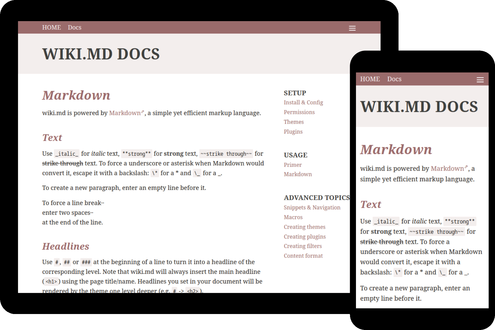

# wiki.md

Yet another Wiki/CMS written in PHP.




## Key features

* File-based - no database required.
  * Every page is a single file in a folder tree.
  * Unlimited folder/grouping depth.
* [Markdown](https://en.wikipedia.org/wiki/Markdown) markup.
  * Including Markdown Extra support (e.g. tables).
* [YAML](https://en.wikipedia.org/wiki/YAML) front matter (YFM) metadata.
* Page versioning / history (udiff).
* Folder passwords.
  * Set separate permissions for create/read/edit/delete.
* Snippet inheritance: Reference your partials (e.g. navigation or banner) in pages on the same/deeper directory levels.
* Elegant, responsive default theme.
* Custom theme support.
* GNU AGPL-3.0 licensed.

Due its file-based nature, wiki.md works best for small to medium traffic sites.

## Requirements

* PHP 7.2+
* Apache `.htaccess` / `mod_rewrite`

## Supported Browsers

Any recent HTML5-capable browser should do.

## Installation

Extract the `*.tar.gz`/`*.zip` into a folder on your web-server and you are (almost) ready to go - wiki.md comes with reasonable, secure defaults. See [Docs](docs/README.md) for details.

## Build from source

This is only recommended for advanced use-cases. For most users the pre-packaged `*.tar.gz`/`*.zip` should be fine.

To build wiki.md yourself, you'll need `git`, `php` v7.2+, `npm` v6.5+ and `gulp` v4. Assuming all requirements are met, just:

```
git clone --depth 1 https://github.com/nerdreich/wiki.md
cd wiki.md
npm install
gulp release
```

Afterwards, the archives can be found in the `dist/` folder.

## Next steps

Read the [Documentation](docs/) to learn more.

## Roadmap

Feel free to report any [issues](https://github.com/nerdreich/wiki.md/issues) you find.

### Planned for v1.1.0

* file/media uploads
* rename-page feature

### Unscheduled ideas

* user settings
  * language
* RSS/feed for changes
* move-page feature
* generate phpdocs during build
* generate sassdocs during build
