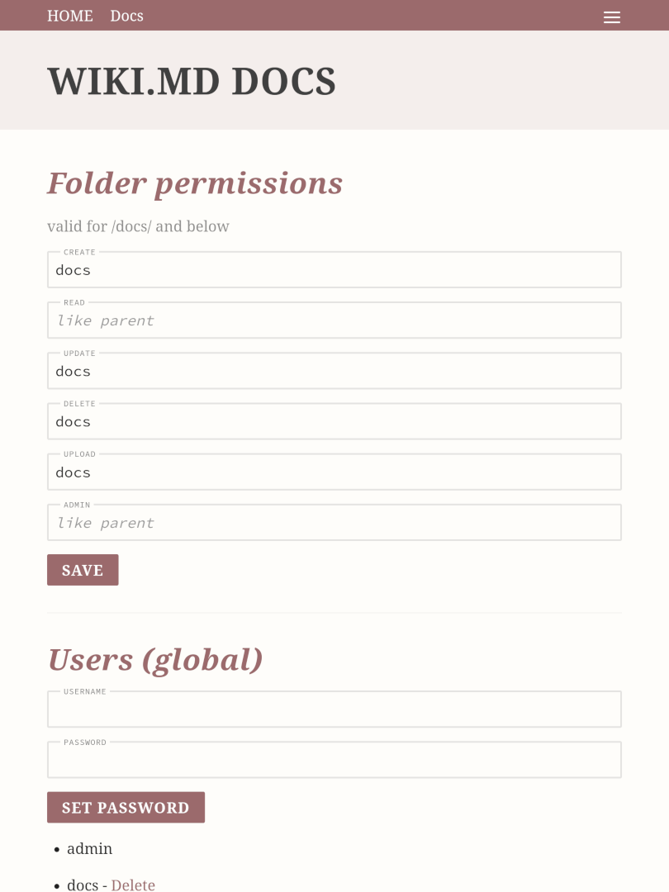

# Page permissions

wiki.md can restrict access to page actions (create, view, edit, delete) for certain users on a (sub)folder level. This is done by setting page permissions. Site default is to let anyone view/read all pages, but only admin-users may create, edit or delete them. wiki.md knows the following permissions:

* `userCreate` - create pages
* `userRead` - view/read pages
* `userUpdate` - edit/update pages
* `userDelete` - delete pages
* `userMedia` - manage uploads (e.g. images)
* `userAdmin` - administrate folders (passwords)

## Folder Editor

To define permissions for a folder, navigate to any page and choose _Permissions_ from the menu.



The restrictions you define for a folder will be valid for that folder, as well as all its sub-folders.

Just enter the usernames, separated by comma if necessary, in each field. Leave a field empty to inherit the permissions from the parent folder, or enter a single `*` to allow all users. For a list of users in the system, refer to the section at the bottom half of the screen. The form won't let you enter users that don't exist.

Using the UI shown above, you can add users and/or give them new passwords. Just enter a username and a password it will update the user file. You can also delete users via a link below, but once you click they are gone!

## Manually changing permissions

The UI will create a file called `_.yaml` in a folder you define permission for. You can also edit that file manually:

```
---
userCreate: docs
userRead: *
userUpdate: docs
userDelete: docs
```

This defines that, everyone (`*`) can read pages, but only `docs` might create (`userCreate`), update (`userUpdate`) or delete (`userDelete`) pages. As there is no reference to `userAdmin` or `userMedia`, these roles are inherited from the parent folder.

If no `_.yaml` file exists in a directory, it inherits all permissions from the parent folder.

Passwords for users mentioned in the `_.yaml` files can be found in `data/.htpasswd`. They are stored in bcrypt format. To add a user/password, just add a new line. To change a password, enter the corresponding bcrypt hash in its line. You can use the `htpassd` provided by Apache's httpd package for that:

```
$ htpasswd -B /path/to/wiki/data/.htpasswd <username>
```
