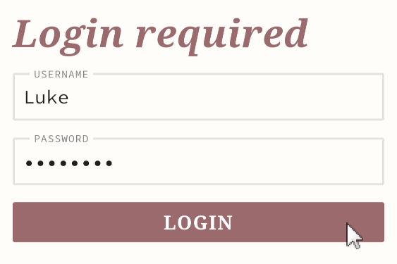
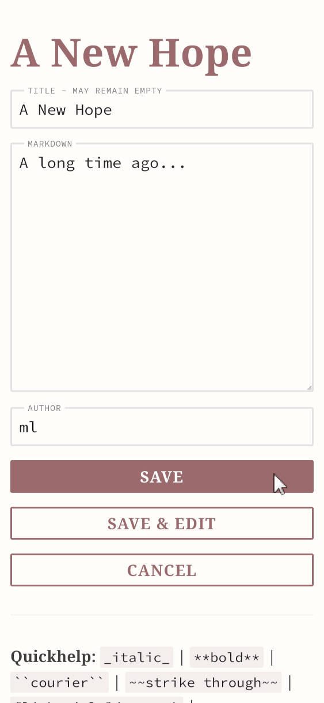
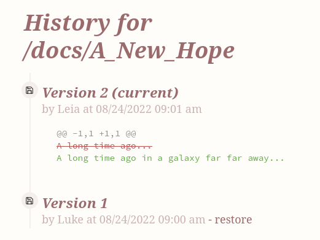

# A wiki.md primer

This primer will give you an overview how to use wiki.md.

## Login

In most configurations, viewing wiki.md pages will not require you to login, but editing them will. You can explicitly log-in by opening the menu and choosing _Login_:

The Login-Screen will show up:

Enter your password and click login. There is no _username_ in wiki.md, just a password.

## Editing pages

When viewing a page, choose _Edit_ from the menu to edit it (login might be required). The Edit-Screen consists of three fields:

The first field is the page title. It defaults to the page name (URL), but you may change it or even leave it empty. It will be convertet to the page headline (`<h1>`) when viewing the page.

The second field is the main content of the page. You can use Markdown syntax in this box. There is a brief quickhelp at the bottom of the editor (below the buttons). A more in-depth help can be found [mardown.md](here).

The third field is the author. You can pick any psydonym you like. wiki.md will remember it until you logout. The author is not your user name, and - in theory - you can use different authors for different pages with the same password.

The _Save_ button will save your work and return to the page viewer. The _Save & Edit_ button will also save but return to the editor. Use _Cancel_ to discard your changes.

## Creating pages

To create a new page you have two options:

* Enter the URL of your new page in your browser.
* Create a link using Markdown's `[link-text](target)` syntax and click on it.

In both cases, provided you have permissions to create pages in the folder you choose, you will be prompted to create the page:

Once you click on it, you will be shown a new, empty editor page. Unless you save this new page there, the page will not be actually created.

## Page history

wiki.md will record all changes to each page. You can view a page's history by choosing *History* from its menu:

The page history will display the author and time of each change. Between two entries it will display the changes that were applied.

To revert to a previous version, click on the corresponding *Restore V?* button. This will not change the page yet, but open the editor showing the restored version. If you save that version, it will become the current one again.

## Logout

wiki.md will keep you logged in until you clear your browser's cache. To manually logout, open the menu and choose _Logout_. You will be immediately logged out.

Depending on your permissions and the page you are at, you might see more items in that menu.
