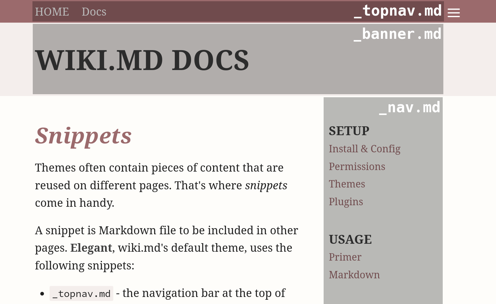

# Snippets

Themes often contain pieces of content that are reused on different pages. That's where _snippets_ come in handy.

A snippet is Markdown file to be included in other pages. **Elegant**, wiki.md's default theme, uses the following snippets:

* `_topnav.md` - the navigation bar at the top of pages
* `_banner.md` - the headline area below the navigation bar
* `_nav.md` - the site navigation (to the right at desktop resolutions, to the bottom on mobile)



To differentiate snippets from regular pages, they start with an underscore (`_`). However, they are still Markdown files and can be edited using the page editor.

Other themes might come with different snippets.

## Scope

Each snippet is valid in the folder it is found, as well as all sub-folders. If another snippet of the same name is encountered at a deeper level, it is valid until overridden even deeper again.

## Editing snippets

Just enter the URL of the snippet in your browser and choose `Edit` from the menu (assuming you have proper permissions). For example, to edit the top navigation for your whole site, edit:

```
https://wiki.example.org/_topnav
```

To edit the default banner for all pages, edit:

```
https://wiki.example.org/_banner
```

To edit the default navigation for all pages, edit:

```
https://wiki.example.org/_nav
```

If you are reading the `/docs` folder, you will notice that the banner and navigation has changed. That's because the following snippets exist:

```
https://wiki.example.org/docs/_banner
https://wiki.example.org/docs/_nav
```
